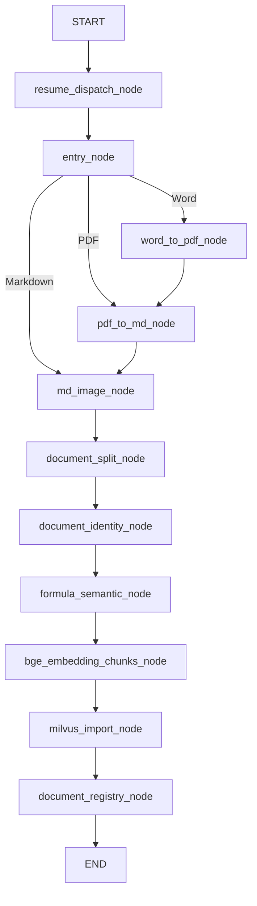

# 入库与查询 Graph：节点、条件边和 State

按当前 `processor/import_processor/main_graph.py`、`processor/query_processor/main_graph.py` 及各自的 `state.py` 核对。入库侧注册 **11 个节点、2 处条件路由**；查询侧注册 **15 个节点、6 处条件路由**。节点数不含 START/END，条件路由数按 `add_conditional_edges` 调用位置统计，不是所有分支目标的总数。

## 入库侧

| Node | 职责 |
| --- | --- |
| `resume_dispatch_node` | 根据上次完成节点分发恢复任务 |
| `entry_node` | 文件检查、类型识别 |
| `word_to_pdf_node` | Word 转 PDF |
| `pdf_to_md_node` | PDF 转 Markdown |
| `md_image_node` | 图片语义解析 |
| `document_split_node` | 层级感知切片 |
| `document_identity_node` | 文档 ID、规范标题、别名和主题建档 |
| `formula_semantic_node` | 公式语义增强 |
| `bge_embedding_chunks_node` | BGE-M3 稠密、稀疏向量化 |
| `milvus_import_node` | 切片写入 Milvus |
| `document_registry_node` | 文档档案写入注册表 |

正常执行链路：

恢复分支未逐条画入图中，实际条件边如下：

| 出发节点／路由函数 | 判断与去向 |
| --- | --- |
| `resume_dispatch_node` / `route_resume` | `resume_after_node` 为空则进入 `entry_node`；上次完成 entry 则按文件类型分流；完成其他节点则进入链路的下一节点；完成 registry 则 END；未知节点报错 |
| `entry_node` / `route_fun` | 按 `is_md_read_enabled`、`is_pdf_read_enabled`、`is_word_read_enabled` 依次判断，分别进入图片解析、PDF 转换、Word 转换；类型无法识别时报错 |

`ImportGraphState` 的关键字段：

| 分组 | 字段及含义 |
| --- | --- |
| 任务与版本 | `task_id`；`source_hash` 用于文件幂等；`logical_document_id` 标识跨版本逻辑文档；`version_id` 标识版本；`doc_id` 标识实际文档记录 |
| 恢复与资源 | `resume_after_node`、`embedding_completed_batches`、`resource_objects` |
| 格式控制 | `is_md_read_enabled`、`is_pdf_read_enabled`、`is_word_read_enabled` |
| 文件路径 | `import_file_path`、`file_dir`、`word_path`、`pdf_path`、`md_path` |
| 文档身份 | `file_title`、`canonical_title`、`primary_subject`、`document_identity`；`theme_name` 为兼容字段 |
| 中间结果 | `md_content`、`chunks`，承载正文及逐步增强后的切片 |

这里使用 `TypedDict(total=False)`，默认状态通过深拷贝创建。断点由应用层保存并恢复，图调用 `.compile()` 时未传入 LangGraph checkpointer。活动版本发布由 `service/file_process_service.py` 在图成功后调用 `activate_document_version` 完成，它不是图中的第 12 个节点。

## 查询侧

| Node | 职责 |
| --- | --- |
| `query_type_node` | 判断文本、图片或多模态查询 |
| `image_query_node` | 生成图片语义查询 |
| `document_route_node` | 查询改写、子问题拆分、文档定位及范围控制；同次 LLM 调用输出是否需要规划 |
| `agent_router_node` | hybrid 模式优先采用 LLM 的规划判断，判断不可用时回退规则 |
| `planner_node` | 生成检索计划、选择工具 |
| `vector_search_node` | 原问题 BGE-M3 稠密／稀疏混合检索 |
| `hyde_search_node` | 生成假设文档并检索 |
| `bm25_search_node` | BM25 关键词检索 |
| `rrf_merge_node` | 融合三路检索结果 |
| `rerank_node` | BGE-Reranker 重排 |
| `conflict_judge_node` | 对高分歧边界候选进行选择性仲裁 |
| `evidence_evaluator_node` | 检查证据覆盖，决定停止、补检或请求澄清 |
| `replan_node` | 调整检索计划并检查执行预算 |
| `context_expansion_node` | 扩展父块、章节及相邻块上下文 |
| `answer_output_node` | 生成／输出答案，支持流式输出 |

主干为：输入识别 → 图片语义处理（需要时）→ 文档路由 → Agent 路由 → 规划（需要时）→ 三路检索 → RRF → 重排 → 仲裁 → 证据评估（需要时）→ 上下文扩展 → 答案输出。证据不足时，经重规划返回检索；提前答案可直接进入输出。

多子问题计划现在在各子问题内部完成召回、RRF 和 Rerank，跨子问题只合并去重并保留归属；这一分支跳过全局排序仲裁，只对缺失且依赖已满足的子问题补检索。具体字段、依赖和预算规则见 [按子问题组织复杂查询检索](subquestion_retrieval.md)。

`document_route_node` 将查询理解模型的 `needs_planning` 保存为 `query_needs_planning`：严格的布尔值 `true` / `false` 分别表示需要／不需要规划，缺失、类型错误或调用失败时保存为 `None`。启用 Agentic 且处于 `hybrid` 模式时，有效模型判断直接决定分流（包括 `false`），只有 `None` 才使用原有复杂度规则。`agentic_route_reason` 用 `llm_needs_planning` / `llm_simple_query` 标识模型决策，规则回退沿用原有原因。功能开关及 `workflow` / `agentic` 强制模式仍优先于模型判断。

| 出发节点／路由函数 | 判断与去向 |
| --- | --- |
| `query_type_node` / `route_after_query_type` | text → document_route；image/multimodal → image_query；非法类型报错 |
| `document_route_node` / `route_after_document_route` | `answer` 去除空白后非空 → answer_output；否则 → agent_router |
| `agent_router_node` / `route_after_agent_router` | `agentic_active` 为真 → planner；否则并行进入 vector、hyde、bm25 |
| `conflict_judge_node` / `route_after_conflict_judge` | `agentic_active` 为真 → evidence_evaluator；否则 → context_expansion |
| `evidence_evaluator_node` / `route_after_evidence_evaluator` | 优先检查 `answer`，有答案 → answer_output；否则有 `agent_stop_reason` → context_expansion；否则 → replan |
| `replan_node` / `route_after_replan` | 有 `agent_stop_reason` → context_expansion；否则再次进入三路检索 |

必须区分图连线和节点内判断：planner 在图上连接全部三路检索，具体是否执行工具由各节点内部的 `agent_selected_tools` 控制。三路通过 `add_edge(RETRIEVAL_NODES, "rrf_merge_node")` 同步汇合。hard/soft/global 是文档路由策略，并不额外增加条件边。

`QueryGraphState` 的关键字段：

| 分组 | 字段 |
| --- | --- |
| 输入与会话 | `session_id`、`task_id`、`original_query`、`display_query`、`query_type`、`history`、`is_stream` |
| 图片与改写 | `query_image_bytes`、`query_image_mime_type`、`image_query_description`、`retrieval_query`、`rewritten_query`、`retrieval_queries`、`query_decomposed` |
| 文档范围 | `document_mentions`、`document_candidates`、`selected_documents`、`hard_filter_doc_ids`、`soft_filter_doc_ids`、`document_route_mode`、`document_route_locked`、`document_route_reason`、`document_route_scope_history`、`theme_names` |
| 范围回退记录 | `vector_route_fallback`、`hyde_route_fallback`、`bm25_route_fallback` |
| 检索中间结果 | `embedding_chunks`、`hyde_embedding_chunks`、`bm25_chunks`、`rrf_chunks`、`rerank_candidates`、`reranked_docs`、`expanded_docs` |
| 仲裁 | `conflict_judge_triggered`、`conflict_judge_decisions` |
| 规划与预算 | `agentic_active`、`agentic_route_reason`、`agent_plan`、`agent_selected_tools`、`agent_iteration`、`agent_tool_calls`、`agent_started_at`、`agent_current_query` |
| 跨轮证据 | `agent_retrieval_history`、`agent_evidence_pool`、`agent_new_chunk_ids` |
| 子问题分组 | `active_retrieval_tasks`、`active_subquestion_indices`、`subquestion_vector_chunks`、`subquestion_bm25_chunks`、`subquestion_hyde_chunks`、`subquestion_rrf_chunks`、`subquestion_rerank_candidates`、`subquestion_evidence`、`subquestion_retrieval_history`、`subquestion_resolved_questions`、`agent_new_evidence_pairs` |
| 覆盖与停止 | `coverage_missing_subquestion_indices`、`coverage_protected_chunk_ids`、`evidence_evaluation`、`evidence_sufficient`、`missing_aspects`、`evidence_next_action`、`agent_stop_reason` |
| 输出与溯源 | `answer`、`final_context_chunk_ids`，后者记录真正进入最终上下文的切片 |

查询 State 使用 `TypedDict`，默认值同样深拷贝；未声明 `Annotated` reducer。三路检索分别返回各自字段，再由 RRF 显式融合。条件边实际检查的是 `agent_stop_reason` 等字段，不能把“证据充分”的业务描述直接当成代码中的布尔判断。Evaluator 通常评估证据，也可能生成澄清提示；普通证据答案由输出节点生成。

## 可用于答辩的简短表述

“入库图负责把异构文件加工为可追踪版本的文档和切片，有 11 个节点，两处条件路由分别处理断点恢复和文件格式分流。查询图有 15 个节点、6 处条件路由，以三路检索、融合、重排和上下文扩展为主干，复杂问题增加规划、证据评估和受预算约束的补检循环。State 不仅保存输入和答案，还保存文档范围、各阶段候选证据、跨轮证据池和停止原因，因此可以定位问题出在文档路由、检索、证据覆盖还是生成环节。”
